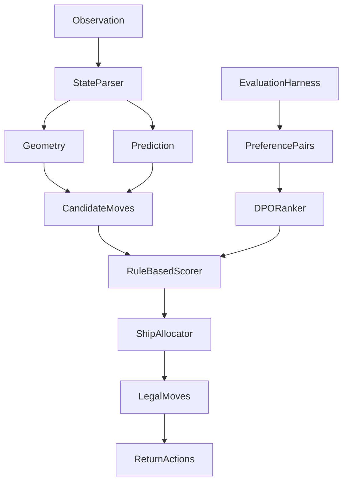

# Orbit Wars Agent Plan

## Main Direction

The fastest path to a strong submission is a reliable rule-based agent that understands production value, travel timing, sun avoidance, orbiting planets, overcommit risk, defense, and endgame scoring.

We will not use pretraining (PT) or fine-tuning (FT) as a core strategy. There is no local expert dataset, and raw imitation would be less reliable than using the known rules and simulator directly.

We will not use PPO/full reinforcement learning initially. PPO is too expensive for the first strong version because Orbit Wars has long 500-turn games, sparse final rewards, multi-agent instability, and awkward actions with continuous angles and variable ship counts.

We will use DPO only after we have a strong rule-based/self-play pipeline. In this project, DPO should mean preference optimization over candidate moves or strategy decisions generated from local games. It should improve the rule-based agent's ranking choices, not replace the core physics and tactical logic.

## Why This Strategy

- The game has exact rules, visible state, and deterministic geometry. Rule-based planning can exploit that immediately.
- The action space is awkward for raw ML: multiple moves per turn, continuous angles, variable ship counts, moving targets, and 500-turn games.
- A strong deterministic baseline is easier to debug, submit, and improve from Kaggle replays.
- DPO becomes useful once we can create preference pairs from self-play: in similar states, prefer the move/strategy that led to better outcomes.
- PT/FT is inefficient now because there is no strong labeled dataset and no obvious pretrained model that naturally fits this game.
- PPO is less efficient than DPO for this project because it needs many online rollouts and careful reward design, while DPO can learn from stored comparisons generated by the rule-based agent and evaluation harness.

## Learning Decision: DPO Over PPO

Use DPO-style candidate ranking, not PPO, for the first learning layer.

DPO is the better fit because:

- It can train offline from saved games and replay comparisons.
- It ranks already-legal candidate moves, so it cannot invent invalid raw actions.
- It is cheaper to iterate than PPO because every rollout can be reused for preference data.
- It is easier to debug: if the DPO ranker prefers a bad move, we can inspect the exact preferred/rejected candidate pair.
- It can be disabled safely; the rule-based scorer remains the fallback.

PPO is deferred because:

- It needs far more simulator games.
- It requires careful reward shaping and advantage estimation.
- It can overfit to the current opponent pool.
- It is more likely to learn unstable behavior before the rule-based engine is strong.
- It adds training complexity before we have enough evidence that candidate ranking is the bottleneck.

Revisit PPO only if:

- The rule-based agent plus DPO plateaus.
- The evaluation harness can run thousands of games quickly.
- The candidate action space is stable.
- We have a strong opponent pool and clear reward design.

## Current Repo State

Important files:

- `README.md`: full game rules, observation fields, action format, and configuration.
- `agents.md`: local testing, Kaggle CLI, submission, replay, and logs workflow.
- `nextsteps.md`: operational task list for improving and submitting the agent.
- `main.py`: valid Kaggle entrypoint with `agent(obs)` and traceable production-aware, sun-safe candidate decisions.
- `geometry.py`: tested distance, angle, fleet-speed, travel-time, and sun-intersection helpers.
- `generate_rollouts.py`: local rollout generator with decision traces.
- `evaluate.py`: fixed-seed evaluation command that writes benchmark summaries.
- `tests/`: focused tests for geometry, decision traces, rollout metadata, and evaluation summaries.

Immediate cleanup priorities:

- Keep `main.py` as the submission entrypoint.
- Keep helper modules small and package every runtime helper imported by `main.py`.
- Keep local testing and benchmark summaries repeatable before promoting strategy changes.
- Treat `nextsteps.md` as the execution plan and this file as the strategic overview.

## Data And Kaggle Workflow

There are three useful data sources for this project:

1. Kaggle competition files, if the competition exposes downloadable files.
2. Local self-play/evaluation rollouts generated with `kaggle_environments`.
3. Kaggle submission replays and logs from real matches.

The most important data will likely be local rollouts and Kaggle replays. The competition download may only contain metadata or starter files, so the plan should not depend on a large supervised dataset existing.

### 1. Kaggle Setup

Install the required tools:

```bash
pip install "kaggle-environments>=1.28.0"
pip install kaggle
```

Authenticate Kaggle using one of:

```bash
kaggle auth login
```

or save the API token to:

```bash
~/.kaggle/access_token
```

Then verify access:

```bash
kaggle competitions list -s "orbit wars"
```

Before submitting, accept the rules on Kaggle:

```text
https://www.kaggle.com/competitions/orbit-wars
```

### 2. Download Competition Data

Download any official competition files into a stable local folder:

```bash
kaggle competitions download orbit-wars -p orbit-wars-data
```

After download, inspect what exists:

```bash
ls -la orbit-wars-data
```

Use this data only if it contains useful assets. If it is empty, starter-only, or not relevant for training, continue with simulator-generated data instead.

### 3. Generate Local Rollout Data

The main dataset for DPO should come from local games.

Create these local data outputs:

- `data/rollouts/`: raw game traces from local evaluation and self-play.
- `data/preferences/`: DPO-style preferred/rejected candidate pairs.
- `results/`: benchmark summaries by agent version and seed set.
- `replays/`: downloaded Kaggle replay JSON files.
- `logs/`: downloaded Kaggle agent logs.

Each rollout record should include:

- Seed and configuration.
- Agent version.
- Opponent lineup.
- Turn number.
- Observation summary.
- Candidate moves generated.
- Candidate scores.
- Chosen moves.
- Final reward/rank/score.
- Runtime or exception metadata.

This gives us reusable data for:

- Debugging bad moves.
- Comparing versions on identical seeds.
- Building DPO preference pairs.
- Tracking whether a change actually improves win rate.

### 4. Download Kaggle Replays And Logs

After submitting, check submissions:

```bash
kaggle competitions submissions orbit-wars
```

List episodes for a submission:

```bash
kaggle competitions episodes <SUBMISSION_ID>
kaggle competitions episodes <SUBMISSION_ID> -v
```

Download replay JSON:

```bash
kaggle competitions replay <EPISODE_ID> -p ./replays
```

Download logs:

```bash
kaggle competitions logs <EPISODE_ID> 0 -p ./logs
```

Use replays/logs to identify:

- Missed expansion opportunities.
- Sun crashes.
- Bad orbit intercepts.
- Overcommit mistakes.
- Failed defenses.
- Weak endgame launches.
- Candidate choices that should become rejected examples for DPO.

### 5. Data Hygiene

Generated evidence is allowed in the repository. Keep rollout JSONL, benchmark summaries, replay files, logs, and competition downloads when they support debugging, strategy comparisons, or reproducibility. These files are evidence for development, not runtime dependencies.

Do not bundle generated evidence into Kaggle runtime submissions unless it is explicitly required by the submitted agent. `submission.tar.gz` should contain only `main.py` and runtime helper modules such as `geometry.py` or `prediction.py`.

Minimum reproducibility rule:

- Every benchmark result should record agent version, seed list, opponent list, and configuration.
- Every DPO preference file should record how the preferred/rejected labels were produced.
- Every Kaggle replay-derived fix should be linked to an episode id in notes or metadata.

## Architecture

Develop as multiple focused files, then either submit as a tarball or inline the final stable code into `main.py`.

- `main.py`: Kaggle `agent(obs)` entrypoint.
- `geometry.py`: distances, angles, fleet speed, sun/planet collision checks.
- `prediction.py`: orbiting planet and comet future-position prediction.
- `state.py`: observation parsing and normalized game-state helpers.
- `candidates.py`: generate legal candidate moves.
- `strategy.py`: rule-based scoring, allocation, defense, attack, and endgame logic.
- `evaluate.py`: batch local games across seeds and opponents.
- `dpo_data.py`: create preference pairs from self-play/replay outcomes.
- `dpo_judge.py`: optional offline API-based judge that reviews replay summaries and candidate comparisons to help label preferred/rejected decisions.
- `dpo_ranker.py`: optional lightweight preference ranker for candidate moves.
- `tests/`: focused tests for geometry, prediction, candidate generation, and strategy scoring.



## Rule-Based Agent Design

### 1. Geometry And Timing

This is the foundation. Bad geometry loses games even if the strategy is good.

Implement:

- `distance(a, b)`.
- `angle_to(source, target)` using `atan2(dy, dx)`.
- `fleet_speed(ships, max_speed=6.0)` from the rules: `1.0 + (max_speed - 1.0) * (log(ships) / log(1000)) ** 1.5`, clamped to `[1.0, max_speed]`.
- `turns_to_reach(distance, ships)`.
- `segment_intersects_circle(start, end, center, radius)`.
- `shot_hits_sun(source, target, sun_center=(50,50), sun_radius=10)`.
- `is_orbiting(planet)` using center distance and radius.
- `predict_orbit_position(initial_planet, angular_velocity, turns)`.
- Approximate moving-target intercept by sampling future positions.

Tests:

- Angles for horizontal, vertical, and diagonal shots.
- Sun-blocked shots through `(50, 50)` are rejected.
- Safe shots around the sun are accepted.
- Fleet speed increases with ship count and matches the Kaggle environment `** 1.5` log curve.
- Orbit prediction keeps planets on the same radius around the sun.

### 2. Candidate Move Generation

The agent should not evaluate every possible angle and ship count. Generate useful legal candidates, then score them.

Candidate types:

- `expand`: capture neutral planets.
- `attack`: capture enemy planets.
- `reinforce`: defend friendly planets.
- `consolidate`: move ships from low-value backline planets to valuable/frontline planets.
- `comet`: capture or evacuate comets when worthwhile.
- `endgame`: launch surplus ships or final attacks near turn 500.
- `wait`: do nothing when ships are better saved.

Each candidate should include:

- Source planet id.
- Target planet id if any.
- Launch angle.
- Ships to send.
- Estimated travel turns.
- Expected target ships at arrival.
- Source reserve after sending.
- Production value.
- Sun safety.
- Candidate type.
- Rule-based score.

Bound the search for efficiency:

- Keep only top candidates per source planet.
- Keep only top global candidates before allocation.
- Skip targets blocked by the sun unless an intercept/alternate target exists.
- Skip moves that leave the source below a reserve threshold unless they are decisive.

### 3. Economic Expansion

Early game should capture profitable neutral planets, not simply the nearest planet.

Score neutral targets using:

- Production gained.
- Ships required.
- Travel time.
- Remaining turns.
- Whether the target is static, orbiting, or comet.
- Distance from enemies.
- Risk of immediate recapture.

Basic score:

```python
remaining_after_arrival = max(0, 500 - current_step - travel_turns)
value = target.production * remaining_after_arrival
cost = ships_needed + travel_turns * travel_penalty
score = value - cost - risk_penalty
```

Expansion rules:

- Prefer high production-to-garrison planets.
- Keep source reserves.
- Avoid overkill unless a target is strategically critical.
- Capture orbiting planets only when intercept confidence is good.
- Do not chase comets unless they can repay before expiration.

### 4. Defense

Defense is critical once enemies start launching.

Threat model:

- Project enemy fleets forward.
- Estimate their likely target planet and arrival turn.
- Track incoming enemy and friendly ships per planet.
- Estimate whether the planet survives at arrival.

Defense rules:

- Defend high-production planets first.
- Reinforce only if the cost is less than losing and recapturing.
- Do not drain multiple safe planets to save one low-value planet.
- If a planet is doomed, save ships elsewhere instead of over-defending.
- Prefer short, sun-safe reinforcement paths.

### 5. Attack And Opportunism

After neutral expansion slows, win by taking enemy production.

Attack targets:

- Enemy planets with high production and low ships.
- Enemy planets that just launched ships and became weak.
- Enemy planets far from enemy reinforcements.
- Enemy planets whose capture denies a lot of future production.

Attack rules:

- Include expected enemy production before arrival.
- Add a safety margin for possible reinforcement.
- Avoid attacks that expose our own high-value planets.
- Prefer coordinated attacks only when ship allocation can track overkill.
- Snipe weakened planets quickly.

### 6. Orbiting Planets

Orbiting planets are a major edge if handled well.

Approach:

- Use `initial_planets` and `angular_velocity` when available.
- Predict future target positions at sampled arrival turns.
- Compute travel time to each predicted position.
- Choose the angle where travel time and target future time are closest.
- Reject intercepts that are sun-blocked or have high timing error.

This approximate sampling approach is more reliable and faster to implement than a closed-form intercept solver.

### 7. Comets

Comets are optional production and tactical targets, not always worth chasing.

Use `comets`, `paths`, `path_index`, and `comet_planet_ids`.

Comet rules:

- Estimate remaining lifetime from path length and path index.
- Capture only if production plus tactical value exceeds ships and travel cost.
- Evacuate owned comets before they leave the board.
- Do not send large fleets to short-lived comets.

### 8. Endgame

Final score counts ships on planets plus ships in fleets.

Endgame rules:

- Around turns 470-500, launch surplus ships if they can improve score or pressure enemies.
- Prefer attacks that can arrive before turn 500.
- If arrival is impossible, launching can still preserve score as fleet ships, but avoid exposing planets to capture.
- Keep enough garrison on important planets to avoid late flips.

Suggested phase behavior:

- Turns 0-120: expansion-heavy.
- Turns 120-350: expansion, defense, attacks.
- Turns 350-470: consolidation and targeted captures.
- Turns 470-500: final score conversion.

## Evaluation Plan

Build `evaluate.py` before heavy tuning. This is also how we generate most of the useful data.

Run:

- Current `main.py` vs random.
- Rule-based agent vs random.
- Rule-based agent vs nearest baseline.
- New version vs previous best version.
- Multiple fixed seeds for reproducibility.
- 2-player and 4-player games if supported locally.

Track:

- Win rate.
- Average reward/rank.
- Final ship score.
- Owned production over time.
- Planet count over time.
- Invalid moves.
- Runtime per turn.
- Common loss reason.

Promotion rule:

- A new strategy becomes default only if it improves held-out seed performance or fixes a clear replay failure without causing a larger regression.

Suggested benchmark sets:

- `quick`: 10-20 seeds for rapid iteration.
- `standard`: 100+ seeds before changing the default agent.
- `submission`: larger held-out seed set before Kaggle upload.

Suggested output files:

- `results/quick_<agent_version>.json`
- `results/standard_<agent_version>.json`
- `data/rollouts_v2/<agent_version>/<agent_version>_vs_<opponent>_seed_<seed>.jsonl`

## DPO Plan

DPO comes after the rule-based agent and evaluator exist.

Goal:

- Learn better candidate ranking from preference pairs while preserving the rule-based candidate generator and legality checks.
- Use an optional API-key-backed judge to help decide which candidate, turn, or trajectory was better when outcome-based labels are ambiguous.

What DPO should optimize:

- Given the same state and candidate list, prefer the move or candidate ranking that led to a better outcome.
- Improve choices among expansion, defense, attack, comet, consolidation, and endgame actions.
- Reduce repeated mistakes found in local games or Kaggle replays.

Preference data sources:

- Self-play games where two policy versions choose different moves in comparable states.
- Same seed comparisons between old and new rule weights.
- Replay analysis where one decision clearly led to better/worse outcome.
- Heuristic candidate score disagreements: preferred move is the one from the better-scoring rollout.
- API judge labels from compact state/candidate/replay summaries, used only for offline DPO dataset creation.

Preference pair format:

- State features.
- Candidate features.
- Preferred candidate id.
- Rejected candidate id.
- Final reward difference.
- Turn number.
- Opponent type.
- Policy version metadata.
- Label source: outcome, replay review, heuristic comparison, or API judge.
- Judge confidence and explanation when an API judge is used.

### API Judge Workflow

The API key should only be used offline for analysis and labeling. It must never be hardcoded, committed, bundled into `submission.tar.gz`, or used by `main.py` during Kaggle matches.

Recommended secret handling:

```bash
export DPO_JUDGE_API_KEY="..."
```

Do not write the key into source files, notebooks, `plan.md`, logs, replay files, or generated preference datasets.

The API judge should receive compact, structured summaries, not huge raw replays:

- Current turn and remaining turns.
- Our planets, enemy planets, nearby fleets, and production totals.
- Candidate A and candidate B.
- Estimated travel time, ships sent, target value, sun safety, reserve left, and threat status.
- Outcome context if available, such as final reward or what happened after the move.

Ask the judge for:

- Preferred candidate: A, B, or uncertain.
- Short reason.
- Confidence score.
- Tags like `bad_sun_risk`, `overcommit`, `missed_defense`, `good_expansion`, `bad_endgame`, or `unclear`.

Use judge labels conservatively:

- Keep only high-confidence labels.
- Drop `uncertain` labels.
- Prefer hard outcome data over judge opinion when they conflict.
- Sample diverse turns so the dataset does not become only early expansion.
- Periodically audit judge-labeled pairs by reading a few examples manually.

The API judge is for DPO data creation, not PPO. This keeps the plan efficient: the rule-based engine generates candidates, local rollouts provide outcomes, and the judge helps convert tricky comparisons into preferred/rejected pairs.

Efficient implementation:

- Start with a lightweight pairwise ranker if full DPO is too heavy.
- Use DPO-style loss once policy/reference log-probabilities are available.
- Keep the model small enough to package or distill into simple weights.
- Always keep rule-based fallback if DPO model fails or is slower than expected.
- Use API judge labels only as training data for the ranker; the final Kaggle agent should run without network calls.

DPO acceptance criteria:

- Beats the pure rule-based agent on held-out seeds.
- Improves known failure cases from replay review.
- Does not create illegal moves because it only ranks legal candidates.
- Does not exceed Kaggle turn-time limits.

## Implementation Phases

### Phase 0: Environment, Data, And Valid Baseline

- Install/verify `kaggle-environments`.
- Install/verify Kaggle CLI.
- Confirm Kaggle competition access.
- Download competition files with `kaggle competitions download orbit-wars -p orbit-wars-data`.
- Create local generated-data folders as needed: `data/rollouts_v2`, `data/preferences`, `results`, `replays`, `logs`.
- Keep `main.py` runnable.
- Make local smoke testing work.
- Confirm game can run against random.

### Phase 1: Geometry

- Create tested geometry helpers.
- Replace incorrect angle logic.
- Add sun avoidance.
- Add fleet speed/travel-time calculations.

### Phase 2: Candidate Generator

- Generate legal expansion candidates first, then add attack, reinforce, consolidate, comet, endgame, and wait candidates as separate tested increments.
- Bound candidates for speed.
- Add per-source ship budget tracking.

### Phase 3: Rule-Based Scoring

- Score candidates by production value, travel time, risk, reserve, and strategic phase.
- Allocate top moves while avoiding overcommit.
- Benchmark against random and nearest baseline.

### Phase 4: Prediction

- Add orbit prediction.
- Add approximate intercept sampling.
- Add comet lifetime estimation.
- Rebenchmark.

### Phase 5: Defense And Attack

- Add incoming fleet threat modeling.
- Add reinforcement priorities.
- Add opportunistic enemy attacks.
- Rebenchmark against aggressive variants.

### Phase 6: Endgame

- Add late-game score conversion.
- Add final attack timing.
- Prevent late self-weakening.
- Rebenchmark on long games.

### Phase 7: DPO Data

- Save self-play/evaluation traces.
- Build preference pairs from outcomes.
- Filter noisy or low-confidence pairs.
- Balance preferences across early, mid, and late game.
- Add replay-derived preference pairs from Kaggle failures when the better alternative is clear.
- Add `dpo_judge.py` to create API-judged labels from compact candidate comparisons.
- Store judge outputs with confidence, explanation, and label source metadata.
- Exclude low-confidence or uncertain API labels from training.

### Phase 8: DPO Ranker

- Train a small candidate ranker.
- Compare against pure rule-based scoring.
- Use the ranker only where it improves held-out performance.
- Keep deterministic fallback.
- Verify the final submission path does not require the API key or any network access.

### Phase 9: Kaggle Submission Loop

- Package stable agent.
- Submit.
- Download replays and logs.
- Add failure cases to evaluation and DPO data.
- Iterate.

## Submission Checklist

Before each submission:

- `main.py` exposes `agent(obs)`.
- No dependency on unfinished files.
- No browser opening, file writing, or debug spam in submission code.
- No API keys, network calls, or DPO judging code in the runtime submission path.
- Local smoke test passes.
- Batch evaluation has been run.
- Data folders and generated artifacts may be tracked in git, but are not accidentally bundled into the Kaggle runtime package unless needed.
- Runtime is safely below the per-turn limit.
- Moves are legal after final validation.
- If DPO/ranker is used, heuristic fallback still works.

## Final Priority Order

1. Evaluation harness and trace validation.
2. Rule-based geometry correctness, including fleet-speed parity with the Kaggle environment.
3. Production-aware expansion.
4. Sun-safe targeting.
5. Source ship budgeting and overcommit control.
6. Orbit-aware targeting.
7. Defense against incoming fleets.
8. Opportunistic attacks.
9. Endgame score conversion.
10. DPO candidate ranking.
11. Kaggle replay feedback loop.

The strongest efficient path is not PT/FT and not raw RL. It is a rule-based tactical engine first, then DPO-assisted candidate ranking once we can generate meaningful preferences from self-play and replay outcomes.
